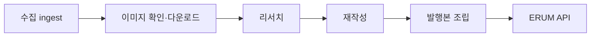

# IJ Complete Workflow — Operator Runbook

**Branch:** `news-engine-test` only. Do not commit workflow changes to `main`.

This runbook covers the IJ editorial pipeline on the test branch: ingest → image (required) → research → rewrite → publish body → ERUM API. It does **not** cover production deploy, frontend, or hourly prod cron.

---

## Pipeline overview



| Step | Korean | Module / entry | Notes |
|------|--------|----------------|-------|
| 1 | 수집 | `ingest.enrich_article_from_page`, RSS / `TARGET_URL_IDS` | Thin body or fetch fail → drop before image |
| 2 | 이미지 (필수) | `article_images.require_article_image` | No usable image → article skipped; never reaches research/rewrite |
| 3 | 리서치 | `research_collector`, `ij_pipeline._research_and_build_context` | `publish_grade D` → drop |
| 4 | 재작성 | `rewrite_validate`, `target_engine` | Quality loop in review modes |
| 5 | 발행본 | `publish_body.prepare_ij_publish_body` | v4 layout, sources footer |
| 6 | ERUM API | `engine.py` publish path | `REVIEW_ONLY=1` → no API; `hidden-publish` → `DRAFT` only |

IJ-specific order is enforced in `engine/pipeline/ij_pipeline.py`: **image gate runs before any LLM research** for `assigned == "IJ"`.

---

## How to run

Entry point:

```bash
cd /path/to/erum-news-engine   # news-engine-test branch
FIXTURE_URL='https://www.korea.kr/news/policyNewsView.do?newsId=...' \
  .venv/bin/python scripts/run_ij_full_pipeline.py --mode <dry-run|review|hidden-publish>
```

| Mode | Env set by CLI | Underlying script | Max quality attempts |
|------|----------------|-------------------|----------------------|
| `dry-run` | `REVIEW_ONLY=1`, `EDITORIAL_IMAGE_PROBE=1` (no `EDITORIAL_IMAGE_PROBE_DOWNLOAD`) | `run_editorial_quality_loop.py` | 3 (default) |
| `review` | `REVIEW_ONLY=1`, `EDITORIAL_IMAGE_PROBE=1`, `EDITORIAL_IMAGE_PROBE_DOWNLOAD=1` | `run_editorial_quality_loop.py` | 12 (default) |
| `hidden-publish` | `REVIEW_ONLY=0`, `HIDDEN_PUBLISH_TEST=1`, `PUBLISH_STATUS=draft` | `engine.py` | N/A (single-target) |

**hidden-publish** requires `TARGET_URL_IDS` (comma-separated URL IDs from DB or test fixtures):

```bash
TARGET_URL_IDS='148965108' \
  .venv/bin/python scripts/run_ij_full_pipeline.py --mode hidden-publish
```

CI (branch `news-engine-test` only): `.github/workflows/ij-editorial-review.yml` runs pytest + `dry-run` on push / `workflow_dispatch`.

---

## What appears on the public site

| Mode | ERUM API called? | Site visibility |
|------|------------------|-----------------|
| `dry-run` / `review` | No (`REVIEW_ONLY=1`) | Nothing public — artifacts only under `review_outputs/` |
| `hidden-publish` | Yes, status **DRAFT** | Preview URL only; **not on homepage**, not live `PUBLISHED` |

- Nothing is publicly listed until an operator promotes to `PUBLISHED` outside this workflow.
- `DRAFT` = preview-only in admin / preview endpoints; treat as non-production.

---

## Image policy (non-negotiable)

1. Image is resolved and **downloaded + quality-checked** before research or rewrite.
2. **No image → article skipped** at the image step (`PipelineFailure` / `_skip_image_status`).
3. Skipped articles never appear on the homepage or in a published feed.
4. There is no “image optional” path for IJ in review, dry-run, or hidden-publish.

Gate: `require_article_image(article, download=True)` in `engine/pipeline/article_images.py`.

| Check | Threshold |
|-------|-----------|
| Minimum file size | 20 KB |
| Minimum width | 1200 px (env: `MIN_IMAGE_WIDTH`) |
| Aspect ratio | 0.6 – 2.4 (env: `MIN_IMAGE_ASPECT_RATIO`, `MAX_IMAGE_ASPECT_RATIO`) |

Common failure codes: `NO_USABLE_IMAGE`, `IMAGE_QUALITY_TOO_LOW`, `IMAGE_FETCH_HTTP_5XX`.

---

## Image sources (not RSS-only)

Candidates are merged and ranked by score; highest wins after dedupe.

| Priority | Source | Score | Notes |
|----------|--------|-------|-------|
| 1 | RSS `media_content` / `article["image"]` | 100 | `rss:media` |
| 2 | RSS summary/body `` | ~84 (+ caption bonus) | Parsed from feed HTML |
| 3a | Page `og:image` | 95 | From `raw_html` or live fetch |
| 3b | Page `twitter:image` | 92 | Meta tags |
| 3c | JSON-LD `image` | 88 | `page:jsonld` |
| 3d | Article-area `` | 84 | `.view_cont`, `#articleBody`, `article`, etc. |

**Page HTML:** If ingest already stored `raw_html` and any candidate has score ≥ 88, HTTP re-fetch of the article URL is skipped. Otherwise the engine fetches the live page.

Blocked URL patterns (logos, icons, OG placeholders) are in `BLOCKED_IMAGE_PATTERNS` in `article_images.py`.

### korea.kr tuning

`korea.kr/newsWeb/resources/attaches` URLs use a dedicated `Referer: https://www.korea.kr/` on download. For site-specific selectors or blocklists, add an optional profile hook in `article_images.py` (same module as `download_best_image` / `find_best_image`).

---

## Skip report: `skipped_no_image` / `image_status`

When the image gate fails during a batch run, `engine.py` writes:

**File:** `review_outputs/image_skip_report_YYYYMMDD_HHMMSS.json`

```json
{
  "skipped_no_image": 2,
  "skipped_image_articles": [
    {
      "source_url": "https://...",
      "source_title": "...",
      "image_status": "NO_USABLE_IMAGE",
      "image_code": "NO_USABLE_IMAGE"
    }
  ]
}
```

| Field | Meaning |
|-------|---------|
| `skipped_no_image` | Count of articles dropped for image failure this run |
| `image_status` / `image_code` | Same code as `article["_skip_image_status"]` (e.g. `NO_USABLE_IMAGE`, `IMAGE_QUALITY_TOO_LOW`) |

Console: `🖼️ 이미지 없음 스킵: N건` and per-article `🖼️ 이미지 없음 — 기사 스킵 (CODE)`.

Use this to answer “why only N articles today?” without parsing full logs.

---

## Module map

| Concern | Edit this file |
|---------|----------------|
| Image discovery, download, quality gate | `engine/pipeline/article_images.py` |
| Publish HTML body, sources footer | `engine/pipeline/publish_body.py` |
| IJ step order (ingest → image → research) | `engine/pipeline/ij_pipeline.py` |
| Routing, research orchestration | `engine/pipeline/orchestrator.py` |
| Rewrite + validation | `engine/pipeline/rewrite_validate.py` |
| Publish preflight (review, no API) | `engine/pipeline/publish_preflight.py` |
| Non-blocking image probe (preflight only) | `engine/pipeline/image_probe.py` |
| Main loop, skip reports, API publish | `engine.py` |
| CLI modes | `scripts/run_ij_full_pipeline.py` |
| Quality loop (dry-run / review) | `scripts/run_editorial_quality_loop.py` |

---

## Required secrets (hidden-publish)

| Secret / env | Required for | Notes |
|--------------|--------------|-------|
| `GEMINI_API_KEY` | Research (all modes that run LLM) | Review can run without `UPSTAGE_API_KEY` if only Gemini is used |
| `ERUM_API_KEY` (or `ADMIN_API_KEY`) | API publish | hidden-publish only |
| `UPSTAGE_API_KEY` | Rewrite when not in Gemini-only review | Production-style rewrite |
| `R2_ACCOUNT_ID`, `R2_ACCESS_KEY_ID`, `R2_SECRET_ACCESS_KEY` | Image upload to R2 before publish | Publish aborts if R2 upload required and missing |
| `DB_HOST`, `DB_USER`, `DB_PASSWORD`, `DB_NAME` | `engine.py` startup | Always loaded; batch dedup when not in target-only mode |

GitHub Actions dry-run: `GEMINI_API_KEY` + `FIXTURE_URL` (see workflow file).

Local: optional `~/.env.erum_infra` via dotenv.

---

## `review_outputs/` vs GitHub

Artifacts are **local** or **CI job artifacts** — not bulk-committed (`.gitignore` covers most `*.json`).

| Artifact | Produced by | Use |
|----------|-------------|-----|
| `editorial_compare_*.md` | Quality loop / fixture review | Human-readable before/after, image/publish preflight section |
| `editorial_quality_*.json`, `editorial_quality_score.json` | `write_editorial_quality_bundle` | Scores, body HTML metadata per attempt |
| `editorial_preflight_latest.json` | `run_editorial_preflight_e2e.py` | `would_publish_api`, `layout_type`, `image_status` |
| `editorial_batch_summary_*.json` | Batch quality loop | Multi-URL run summary |
| `image_skip_report_*.json` | `engine.py` after batch with image skips | `skipped_no_image` diagnostics |
| `rewrite_review_*.md` | `REVIEW_ONLY` engine path | Legacy review report |

**GitHub:** Use the Actions run for `news-engine-test` — workflow passes/fails on pytest + dry-run. Download workflow artifacts or read logs; do not rely on committed `review_outputs/` in the repo.

**Compare:** PR diff shows **code** changes; `review_outputs/` shows **runtime behavior** for a specific URL/fixture. Use both: code review in GitHub, quality/image decisions in local or CI artifacts.

---

## What is NOT included

- Merge to `main` or production branch policy
- Vercel / frontend deploy (impactjournal.kr app repos)
- Hourly production cron (`news-engine.yml` schedule on main)
- Full NN/CB pipeline parity with this IJ workflow
- Frontend repository changes
- DB migrations / `EDITORIAL_PERSIST` editorial DB writes (off by default)
- Live `PUBLISHED` without explicit operator approval outside `hidden-publish` smoke (`DRAFT` only)

---

## Quick troubleshooting

| Symptom | Check |
|---------|--------|
| 0 articles after ingest | `image_skip_report_*.json`, `skipped_no_image` |
| Quality loop exits early | `editorial_quality_score.json`, compare MD in `review_outputs/` |
| hidden-publish fails immediately | `TARGET_URL_IDS` set; `ERUM_API_KEY`; R2 env vars |
| korea.kr image 403 | Referer path in `article_images.download_best_image` |
| CI dry-run red | Actions log for `FIXTURE_URL` fetch / `GEMINI_API_KEY` |

---

## Related docs

- `docs/editorial-pipeline.md` — env flags and fixture commands
- `docs/ij-editorial-workflow-v2-design.md` — v2 design and quality loop
- `docs/superpowers/plans/2026-06-02-ij-complete-workflow-news-engine-test.md` — implementation plan
